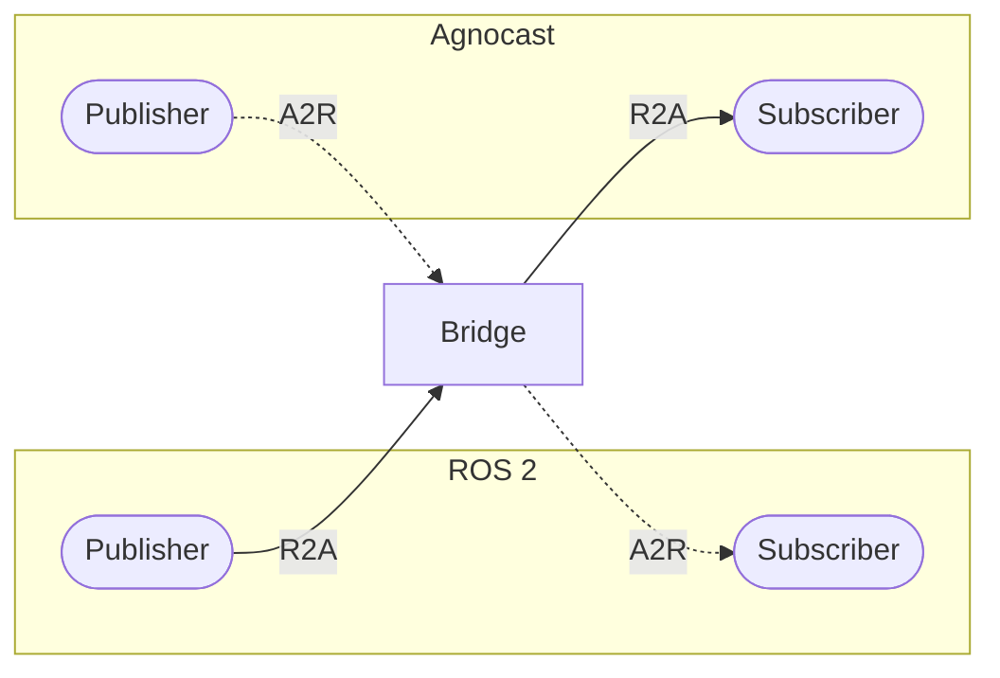
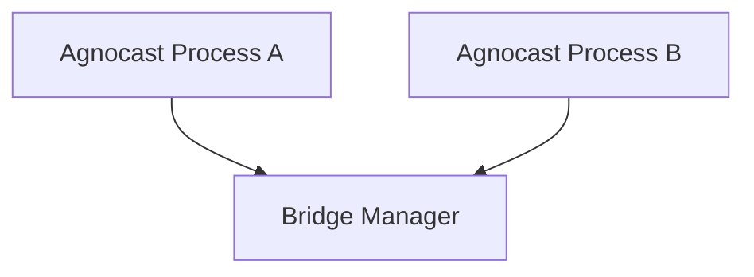
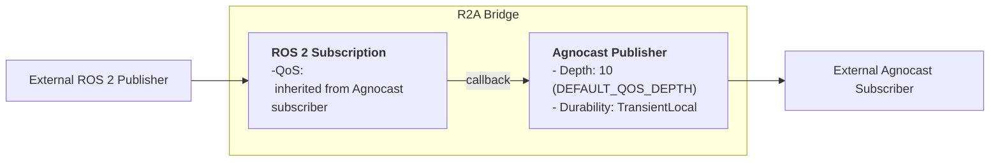
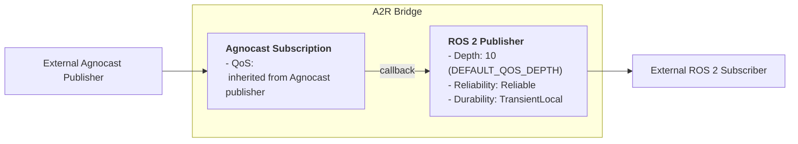

# Bridge Feature

## Overview

The Agnocast Bridge enables communication between Agnocast nodes and ROS 2 nodes. It automatically forwards messages bidirectionally.
Message circulation (echo-back) is automatically prevented by the bridge's internal logic. No additional configuration or constraints are required.

- **R2A (ROS 2 → Agnocast)**: Forwards messages from ROS 2 publishers to Agnocast subscribers
- **A2R (Agnocast → ROS 2)**: Forwards messages from Agnocast publishers to ROS 2 subscribers



## Bridge Modes

Agnocast supports the following bridge modes controlled by the `AGNOCAST_BRIDGE_MODE` environment variable:

| Mode | Value | Description |
|------|-------|-------------|
| Off | `0` or `off` | Bridge disabled; no ROS 2 interoperability |
| On | `on` | Bridge enabled (default). One bridge manager per IPC namespace |

**Note:**

- Values are case-insensitive (e.g., `On`, `OFF`, are valid).
- If an unknown value is provided, it falls back to On mode with a warning.
- `1` / `standard` and `2` / `performance` are accepted for backward compatibility but are deprecated aliases for On mode.

## Bridge Architecture

A global bridge manager handles all bridge requests for all Agnocast processes within an IPC namespace. All topics within the same namespace share this manager.



### Activation Strategy

Bridges are activated **lazily**: a bridge is created only when both an Agnocast endpoint and an external ROS 2 endpoint exist for the same topic. It is destroyed when either endpoint is removed. This avoids unnecessary overhead when there is no ROS 2 counterpart.

### Isolation & Safety

Because a single bridge manager process is shared across all Agnocast processes in the IPC namespace, a crash in the bridge manager will affect all bridged topics.

## Configuration

### Environment Variable

Set `AGNOCAST_BRIDGE_MODE` before launching your application:

```bash
# Bridge enabled (default)
export AGNOCAST_BRIDGE_MODE=on

# Disable bridge
export AGNOCAST_BRIDGE_MODE=off
```

### Using with Launch Files

```python
from launch import LaunchDescription
from launch_ros.actions import Node

def generate_launch_description():
    return LaunchDescription([
        Node(
            package='your_package',
            executable='your_node',
            name='your_node',
            env={'AGNOCAST_BRIDGE_MODE': 'on'}
        ),
    ])
```

### Bridge Plugins (Performance Optimization)

The bridge works out of the box without any additional setup. Internally, it dynamically resolves topic message types at runtime.

For higher throughput, you can optionally provide pre-compiled type-specific bridge plugins via the `agnocast_bridge_plugins` package. When a plugin is available for a given message type, the bridge uses it; otherwise, it falls back to the generic bridge automatically.

**1. Generate the plugin package:**

```bash
# For specific message types
ros2 agnocast generate-bridge-plugins --message-types std_msgs/msg/String geometry_msgs/msg/Pose

# Or for all available message types
ros2 agnocast generate-bridge-plugins --all

# Optionally specify output directory (default: ./agnocast_bridge_plugins)
ros2 agnocast generate-bridge-plugins --all --output-dir ~/my_ws/src/agnocast_bridge_plugins
```

**2. Build the generated package:**

```bash
colcon build --packages-select agnocast_bridge_plugins
```

**3. Source:**

```bash
source install/setup.bash
```

> [!NOTE]
> If you add new custom message types later, regenerate and rebuild the plugins.

#### Advanced: Custom Plugin Path

You can specify custom plugin search paths using the `AGNOCAST_BRIDGE_PLUGINS_PATH` environment variable (colon-separated):

```bash
export AGNOCAST_BRIDGE_PLUGINS_PATH=/path/to/plugins:/another/path
```

## QoS Behavior

### Bridge Internal Structure

Each bridge direction creates a pair of internal publisher and subscriber.
The internal publisher's QoS is fixed to maximize compatibility, ensuring connectivity regardless of the external QoS settings.

**R2A Bridge (RosToAgnocastBridge)**:



> [!WARNING]
> In the R2A Bridge, the internal ROS 2 subscription inherits the QoS settings from the external Agnocast subscriber. <br/>
 Please ensure you avoid a QoS mismatch (specifically, a **Volatile Publisher vs. Transient Local Subscriber** scenario) during ROS 2 communication.

**A2R Bridge (AgnocastToRosBridge)**:


